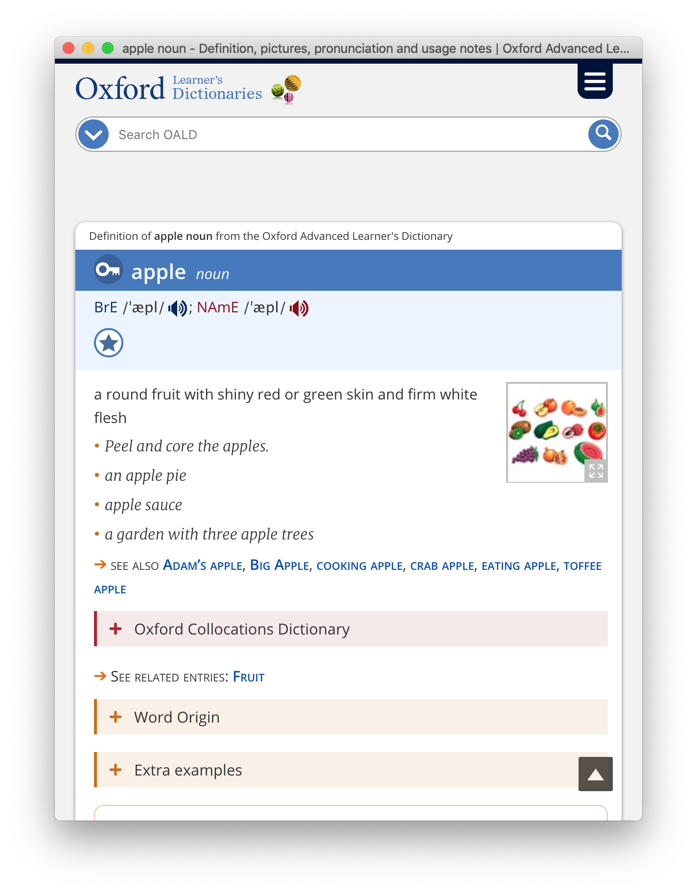

# Oxford Learners Dictionaries

https://www.oxfordlearnersdictionaries.com




## Setup & Run

```
yarn install
yarn start
```


## Release

```
yarn build -p
GH_TOKEN=<GH_TOKEN> yarn release
```

`GH_TOKEN` is your [GitHub Personal access token](https://github.com/settings/tokens).
